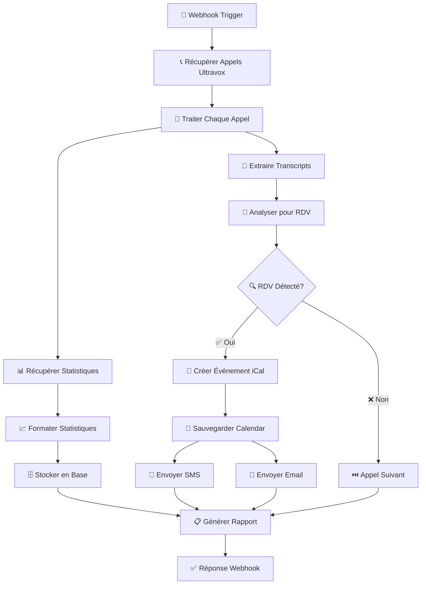

# 🎙️ Workflow n8n Ultravox - Gestion Complète des Appels

> **Workflow automatisé pour gérer les transcripts Ultravox, analyser les rendez-vous et confirmer via iCal**

[](https://n8n.io)
[](https://docs.ultravox.ai)
[](https://docker.com)
[](https://postgresql.org)

## 📋 Vue d'ensemble

Ce projet fournit un workflow n8n complet qui automatise la gestion des appels vocaux Ultravox en :

- 🎯 **Récupérant automatiquement les transcripts** de tous les appels
- 📊 **Collectant les statistiques d'usage** détaillées
- 🤖 **Détectant intelligemment les rendez-vous** dans les conversations
- 📅 **Créant des événements dans Google Calendar**
- 📧 **Envoyant des confirmations** par SMS et email
- 📈 **Générant des rapports de synthèse**

## 🚀 Installation Rapide

### Méthode 1: Installation Automatique (Recommandée)

```bash
# 1. Télécharger les fichiers
wget https://github.com/votre-repo/workflow-ultravox/archive/main.zip
unzip main.zip && cd workflow-ultravox-main

# 2. Rendre le script exécutable
mv install-workflow.txt install-workflow.sh
chmod +x install-workflow.sh

# 3. Exécuter l'installation
./install-workflow.sh
```

### Méthode 2: Installation Manuelle

```bash
# 1. Cloner le repository
git clone https://github.com/votre-repo/workflow-ultravox.git
cd workflow-ultravox

# 2. Configurer l'environnement
cp config-exemple.env .env
nano .env  # Remplir vos credentials

# 3. Démarrer avec Docker
docker-compose up -d
```

## 📂 Structure du Projet

```
workflow-ultravox/
├── 📄 workflow-ultravox-n8n.json      # Workflow n8n principal
├── 📖 instructions-workflow-ultravox.md # Documentation complète
├── ⚙️ config-exemple.env               # Configuration exemple
├── 🐳 docker-compose.yml              # Orchestration Docker
├── 🛠️ install-workflow.sh             # Script d'installation
├── 🗄️ init.sql                        # Initialisation PostgreSQL
├── 📚 README.md                       # Ce fichier
└── 🔧 scripts/
    ├── start.sh                       # Démarrer les services
    ├── stop.sh                        # Arrêter les services
    ├── backup.sh                      # Sauvegarde
    └── update.sh                      # Mise à jour
```

## 🔧 Configuration

### 1. Variables d'Environnement Principales

```bash
# API Ultravox
ULTRAVOX_API_KEY=votre_api_key_ultravox

# Base de données
POSTGRES_HOST=localhost
POSTGRES_DB=ultravox_db
POSTGRES_USER=ultravox_user
POSTGRES_PASSWORD=votre_mot_de_passe

# Notifications
TWILIO_ACCOUNT_SID=votre_account_sid
TWILIO_AUTH_TOKEN=votre_auth_token
GMAIL_CLIENT_ID=votre_gmail_client_id
```

### 2. Credentials n8n Requis

- **Ultravox API** : Clé API de votre compte Ultravox
- **Google Calendar** : OAuth2 pour la création d'événements
- **Twilio** : Pour l'envoi de SMS de confirmation  
- **Gmail** : OAuth2 pour l'envoi d'emails
- **PostgreSQL** : Base de données pour stocker les statistiques

## 🎯 Fonctionnalités Détaillées

### 📝 Gestion des Transcripts

- Récupération automatique via l'API Ultravox
- Analyse textuelle intelligente pour détecter les rendez-vous
- Stockage sécurisé en base de données
- Archivage automatique des anciennes données

### 📊 Statistiques et Analytics

```json
{
  "allTimeStats": {
    "totalCalls": 150,
    "totalDuration": "3600s", 
    "joinedCalls": 142
  },
  "dailyStats": [
    {
      "date": "2025-01-18",
      "totalCount": 12,
      "duration": "720s",
      "joinedCount": 11
    }
  ]
}
```

### 🤖 Détection Intelligente des RDV

Le système détecte automatiquement :
- **Mots-clés RDV** : "rendez-vous", "meeting", "appointment"
- **Dates** : "demain", "lundi", "la semaine prochaine"
- **Heures** : "10h", "14:30", "en fin d'après-midi"
- **Participants** : Extraction automatique des contacts

### 📅 Intégration iCal/Google Calendar

- Création automatique d'événements
- Calcul intelligent des dates/heures
- Invitation des participants
- Synchronisation bidirectionnelle

### 📧 Système de Confirmations

#### SMS (via Twilio)
```
🕐 Rendez-vous confirmé !
📅 Date: Lundi 20 janvier à 14h30
📍 Lieu: À confirmer
📝 Détails: Consultation médicale

Répondez STOP pour vous désabonner.
```

#### Email Automatique
- Templates professionnels personnalisables
- Pièces jointes iCal incluses
- Liens de confirmation/modification
- Rappels automatiques

## 🔄 Flux de Données



## 📖 Guide d'Utilisation

### 1. Déclenchement Manuel

```bash
# Via l'interface n8n
http://localhost:5678
# Login: admin / changeme123

# Via webhook
curl -X POST http://localhost:5678/webhook/ultravox-webhook \
  -H "Content-Type: application/json" \
  -d '{"trigger": "manual"}'
```

### 2. Programmation Automatique

Ajouter un nœud Cron pour automatiser :
```
# Tous les jours à 9h
0 9 * * *

# Toutes les heures
0 * * * *

# Tous les lundis à 8h30  
30 8 * * 1
```

### 3. Monitoring et Logs

```bash
# Logs des conteneurs
docker-compose logs -f n8n

# Statistiques PostgreSQL
docker exec -it postgres-ultravox psql -U ultravox_user -d ultravox_db

# Backup des données
./backup.sh
```

## 📊 Dashboard et Rapports

### Requêtes SQL Utiles

```sql
-- Évolution des appels par jour
SELECT DATE(timestamp), total_calls, joined_calls
FROM ultravox_stats
ORDER BY timestamp DESC
LIMIT 30;

-- Taux de conversion RDV
SELECT 
  DATE(processed_at) as date,
  COUNT(*) as total_calls,
  SUM(CASE WHEN rdv_detected THEN 1 ELSE 0 END) as rdv_count,
  ROUND((SUM(CASE WHEN rdv_detected THEN 1 ELSE 0 END)::DECIMAL / COUNT(*)) * 100, 2) as conversion_rate
FROM ultravox_transcripts
GROUP BY DATE(processed_at)
ORDER BY date DESC;

-- Rendez-vous par période
SELECT 
  DATE_TRUNC('week', start_date) as week,
  COUNT(*) as appointments_count
FROM confirmed_appointments
GROUP BY week
ORDER BY week DESC;
```

### Métriques Clés

- 📞 **Nombre total d'appels traités**
- ⏱️ **Durée moyenne des conversations**
- 🎯 **Taux de détection des RDV**
- ✅ **Taux de confirmation des rendez-vous**
- 📈 **Évolution dans le temps**

## 🔒 Sécurité et Conformité

### Protection des Données

- 🔐 **Chiffrement** des credentials dans n8n
- 🗄️ **Hashage** des données sensibles en base
- 🕐 **Rotation automatique** des tokens d'API
- 📝 **Logs d'audit** détaillés

### Conformité RGPD

- ⏳ **Rétention limitée** des données (90 jours par défaut)
- 🔄 **Anonymisation automatique** des transcripts
- 🚫 **Droit à l'oubli** implémenté
- 📋 **Consentement explicite** requis

## 🛠️ Dépannage

### Erreurs Communes

| Erreur | Cause | Solution |
|--------|--------|----------|
| 401 Ultravox API | Clé API invalide | Vérifier dans les credentials n8n |
| 403 Google Calendar | Permissions OAuth | Réautoriser les scopes |
| Timeout PostgreSQL | Connexion fermée | Redémarrer le conteneur |
| SMS non envoyé | Crédit Twilio insuffisant | Recharger le compte |

### Logs de Debug

```bash
# Activer les logs détaillés
export N8N_LOG_LEVEL=debug

# Suivre l'exécution en temps réel
docker-compose logs -f n8n | grep -i ultravox

# Analyser les performances
docker stats n8n-ultravox postgres-ultravox
```

## 🚀 Améliorations Futures

### Roadmap v2.0

- [ ] **IA Avancée** : GPT-4 pour analyse contextuelle
- [ ] **Multi-langues** : Support français, anglais, espagnol
- [ ] **Dashboard Web** : Interface graphique complète
- [ ] **API REST** : Endpoints pour intégrations externes
- [ ] **Mobile App** : Application de gestion
- [ ] **Webhooks Avancés** : Intégrations tierces
- [ ] **Analytics ML** : Prédictions et insights

### Intégrations Prévues

- 🏢 **CRM** : Salesforce, HubSpot, Pipedrive
- 📊 **Analytics** : Google Analytics, Mixpanel
- 💬 **Chat** : Slack, Discord, Teams
- 📱 **Mobile** : Notifications push natives
- 🎥 **Visio** : Zoom, Teams, Meet intégration

## 🤝 Contribution

Nous encourageons les contributions ! Voici comment participer :

1. **Fork** le repository
2. **Créer** une branche feature (`git checkout -b feature/amazing-feature`)
3. **Commit** vos changements (`git commit -m 'Add amazing feature'`)
4. **Push** vers la branche (`git push origin feature/amazing-feature`)
5. **Ouvrir** une Pull Request

### Standards de Code

- ✅ **Tests unitaires** obligatoires
- 📝 **Documentation** à jour
- 🎨 **Code formaté** (Prettier/ESLint)
- 🔍 **Revue de code** requise

## 📄 Licence

Ce projet est sous licence **MIT** - voir le fichier [LICENSE](LICENSE) pour plus de détails.

## 📞 Support

### Documentation

- 📚 [Guide complet](instructions-workflow-ultravox.md)
- 🎥 [Tutoriels vidéo](https://youtube.com/playlist/ultravox-n8n)
- 🧑‍💻 [Exemples de code](examples/)

### Communauté

- 💬 [Discord Server](https://discord.gg/ultravox-n8n)
- 🐛 [Issues GitHub](https://github.com/votre-repo/issues)
- 📧 [Email Support](mailto:support@votre-domaine.com)

### Formation

- 🎓 **Formations personnalisées** disponibles
- 👨‍🏫 **Consulting** pour déploiements avancés
- 🏆 **Certification** workflow Ultravox

---

## 🏆 Remerciements

Merci à toutes les équipes qui ont rendu ce projet possible :

- **Ultravox** pour leur API exceptionnelle
- **n8n** pour la plateforme d'automatisation
- **La communauté** pour les retours et contributions

---

<div align="center">

**🎉 Transformez vos appels Ultravox en rendez-vous confirmés automatiquement ! 🎉**

*Développé avec ❤️ par Scout Assistant*

</div>