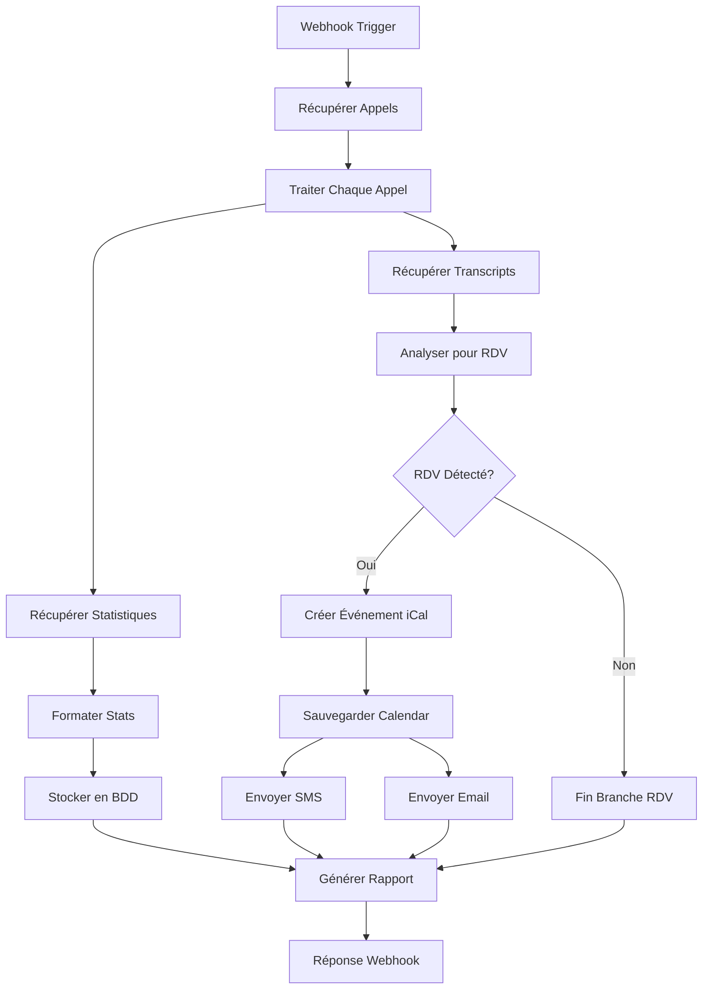

# Workflow n8n Ultravox - Documentation Complète

## 📋 Description du Workflow

Ce workflow n8n automatise la gestion des appels Ultravox en :
- **Récupérant les transcripts** de tous les appels
- **Collectant les statistiques d'usage** 
- **Détectant automatiquement les rendez-vous** dans les conversations
- **Créant des événements iCal** pour les RDV détectés
- **Envoyant des confirmations** par SMS et email
- **Générant des rapports de synthèse**

## 🚀 Installation et Configuration

### 1. Prérequis

**Comptes requis :**
- Compte Ultravox avec API key
- Compte Google Calendar (pour iCal)
- Compte Twilio (pour SMS)
- Compte Gmail (pour emails)
- Base de données PostgreSQL

**Logiciels requis :**
- n8n (version 0.235.0 ou supérieure)
- PostgreSQL (pour stocker les statistiques)

### 2. Import du Workflow

1. **Ouvrir n8n** et aller dans "Workflows"
2. **Cliquer sur "Import"** et sélectionner le fichier `workflow-ultravox-n8n.json`
3. **Sauvegarder** le workflow importé

### 3. Configuration des Credentials

#### Ultravox API
```json
{
  "name": "Ultravox API",
  "type": "httpHeaderAuth",
  "data": {
    "name": "X-API-Key",
    "value": "votre_api_key_ultravox"
  }
}
```

#### Google Calendar
1. Aller dans les credentials n8n
2. Créer "Google Calendar OAuth2"
3. Suivre le processus d'authentification OAuth

#### Twilio SMS
```json
{
  "accountSid": "votre_account_sid_twilio",
  "authToken": "votre_auth_token_twilio",
  "phoneNumber": "+33123456789"
}
```

#### Gmail
1. Créer credentials "Gmail OAuth2"
2. Authentifier avec votre compte Google

#### PostgreSQL
```json
{
  "host": "localhost",
  "port": 5432,
  "database": "ultravox_db",
  "user": "votre_user",
  "password": "votre_password"
}
```

### 4. Création de la Table PostgreSQL

```sql
CREATE TABLE ultravox_stats (
    id SERIAL PRIMARY KEY,
    timestamp TIMESTAMP DEFAULT CURRENT_TIMESTAMP,
    total_calls INTEGER,
    total_duration VARCHAR(50),
    joined_calls INTEGER,
    daily_data JSONB,
    created_at TIMESTAMP DEFAULT CURRENT_TIMESTAMP
);

-- Index pour optimiser les requêtes
CREATE INDEX idx_ultravox_stats_timestamp ON ultravox_stats(timestamp);
CREATE INDEX idx_ultravox_stats_date ON ultravox_stats(DATE(timestamp));
```

## 🔧 Configuration du Workflow

### 1. URLs et Endpoints

Le workflow utilise les endpoints Ultravox suivants :
- `GET /api/calls` - Liste des appels
- `GET /api/calls/{id}/messages` - Transcripts
- `GET /api/accounts/me/usage/calls` - Statistiques

### 2. Déclenchement du Workflow

**Webhook URL :** `http://votre-n8n.com/webhook/ultravox-webhook`

**Méthodes de déclenchement :**
1. **Manuel** - Exécuter via l'interface n8n
2. **Webhook** - POST sur l'URL webhook
3. **Programmé** - Ajouter un nœud "Cron" pour automatiser

### 3. Personnalisation des Détections RDV

Le code de détection des rendez-vous peut être personnalisé :

```javascript
// Mots-clés pour détecter les RDV
const rdvKeywords = [
    'rendez-vous', 'rdv', 'meeting', 'appointment', 
    'reunion', 'entretien', 'consultation'
];

// Mots-clés pour les dates
const dateKeywords = [
    'demain', 'lundi', 'mardi', 'mercredi', 
    'jeudi', 'vendredi', 'samedi', 'dimanche',
    'aujourd\'hui', 'la semaine prochaine'
];

// Mots-clés pour les heures
const timeKeywords = [
    'heure', 'h', ':', 'matin', 'après-midi', 
    'soir', 'midi', 'minuit'
];
```

## 📊 Fonctionnalités Détaillées

### 1. Traitement des Transcripts

- **Récupération automatique** de tous les messages d'un appel
- **Analyse textuelle** pour détecter les intentions de RDV
- **Extraction d'informations** : date, heure, participants
- **Format de sortie** : JSON structuré

### 2. Gestion des Statistiques

**Données collectées :**
- Nombre total d'appels
- Durée totale des conversations
- Appels joints vs non-joints
- Statistiques quotidiennes
- Évolution dans le temps

**Format de stockage :**
```json
{
  "timestamp": "2025-01-18T10:00:00.000Z",
  "allTimeStats": {
    "totalCalls": 150,
    "totalDuration": "3600s",
    "joinedCalls": 142
  },
  "dailyStats": [
    {
      "date": "2025-01-18",
      "totalCount": 12,
      "duration": "720s",
      "joinedCount": 11
    }
  ]
}
```

### 3. Création d'Événements iCal

**Informations automatiquement extraites :**
- **Titre** : "Rendez-vous confirmé via Ultravox"
- **Date/Heure** : Calculée à partir du transcript
- **Description** : Résumé de la conversation
- **Durée** : 1 heure par défaut
- **Lieu** : À définir (personnalisable)

### 4. Système de Confirmations

#### SMS (via Twilio)
```
Bonjour! Votre rendez-vous du [DATE] à [HEURE] 
a été confirmé et ajouté à votre calendrier. 
Détails: [DESCRIPTION]
```

#### Email (via Gmail)
- Sujet : "Confirmation de votre rendez-vous"
- Corps détaillé avec toutes les informations
- Format professionnel

## 🔄 Flux de Données



## 📋 Instructions d'Utilisation

### 1. Déclenchement Manuel

1. **Ouvrir n8n** et aller sur le workflow
2. **Cliquer sur "Execute Workflow"**
3. **Suivre l'exécution** en temps réel
4. **Consulter les résultats** dans chaque nœud

### 2. Déclenchement via Webhook

```bash
# Exemple d'appel webhook
curl -X POST \
  http://votre-n8n.com/webhook/ultravox-webhook \
  -H "Content-Type: application/json" \
  -d '{
    "trigger": "manual",
    "filters": {
      "dateFrom": "2025-01-01",
      "dateTo": "2025-01-18"
    }
  }'
```

### 3. Programmation Automatique

**Ajouter un nœud Cron :**
1. Supprimer le nœud "Webhook Trigger"
2. Ajouter "Cron" node
3. Configurer : `0 9 * * *` (tous les jours à 9h)
4. Connecter au nœud "Récupérer Liste des Appels"

## 🛠️ Personnalisation Avancée

### 1. Filtres d'Appels

Modifier le nœud "Récupérer Liste des Appels" :
```javascript
// Ajouter des paramètres de filtre
{
  "url": "https://api.ultravox.ai/api/calls",
  "method": "GET",
  "qs": {
    "fromDate": "2025-01-01",
    "toDate": "2025-01-18",
    "voiceId": "specific-voice-id"
  }
}
```

### 2. Logique de Détection RDV

Améliorer l'analyse dans le nœud "Analyser Transcript pour RDV" :
```javascript
// Détection plus sophistiquée
const nlpKeywords = {
  urgent: ['urgent', 'rapidement', 'au plus vite'],
  recurrent: ['chaque', 'tous les', 'récurrent'],
  cancel: ['annuler', 'reporter', 'décaler']
};

// Classification automatique
if (urgentKeywords.some(k => text.includes(k))) {
  rdvDetails.priority = 'high';
}
```

### 3. Intégrations Supplémentaires

**Slack Notifications :**
Ajouter un nœud Slack après la confirmation :
```json
{
  "channel": "#rendez-vous",
  "text": "Nouveau RDV confirmé: {{$json.title}} le {{$json.startDate}}"
}
```

**Zapier Integration :**
Ajouter un webhook vers Zapier pour connecter d'autres services.

## 📊 Rapports et Analytics

### 1. Rapport de Synthèse

Le workflow génère automatiquement :
```json
{
  "generatedAt": "2025-01-18T10:00:00.000Z",
  "summary": {
    "totalCallsProcessed": 25,
    "rdvConfirmed": 3,
    "totalCallDuration": "1800s"
  },
  "transcripts": [...],
  "statistics": {...},
  "confirmedAppointments": [...]
}
```

### 2. Dashboard Analytics

**Requêtes SQL utiles :**
```sql
-- Évolution des appels par jour
SELECT DATE(timestamp), total_calls, joined_calls
FROM ultravox_stats
ORDER BY timestamp DESC
LIMIT 30;

-- Taux de conversion RDV
SELECT 
  DATE(timestamp),
  CAST(confirmed_rdv AS FLOAT) / total_calls * 100 as conversion_rate
FROM ultravox_stats;
```

## 🔍 Dépannage

### Erreurs Communes

**1. Erreur API Ultravox 401**
- Vérifier la clé API dans les credentials
- S'assurer que la clé est active

**2. Erreur Google Calendar 403**
- Réautoriser les permissions OAuth
- Vérifier les scopes d'autorisation

**3. Erreur Twilio**
- Vérifier les credentials Twilio
- S'assurer que le numéro est vérifié

**4. Erreur PostgreSQL**
- Vérifier la connexion à la base
- S'assurer que la table existe

### Logs et Debug

**Activer les logs détaillés :**
1. Dans n8n, aller dans Settings
2. Activer "Log Level: Debug"
3. Consulter les logs en temps réel

**Nœuds de debug :**
Ajouter des nœuds "Set" pour voir les données :
```json
{
  "debugData": "={{JSON.stringify($json, null, 2)}}"
}
```

## 🚀 Améliorations Futures

### 1. IA et NLP Avancé

- **Intégration OpenAI** pour une meilleure compréhension
- **Analyse de sentiment** des conversations
- **Classification automatique** des types de RDV

### 2. Intégrations Supplémentaires

- **CRM** (Salesforce, HubSpot)
- **Calendriers multiples** (Outlook, Apple Calendar)
- **Outils de visioconférence** (Zoom, Teams)

### 3. Interface Utilisateur

- **Dashboard web** pour visualiser les données
- **API REST** pour intégrations externes
- **Notifications en temps réel**

---

## 📞 Support

Pour toute question ou assistance :
1. **Documentation n8n** : https://docs.n8n.io
2. **API Ultravox** : https://docs.ultravox.ai
3. **Community n8n** : https://community.n8n.io

---

*Workflow créé le 18 janvier 2025 - Version 1.0*